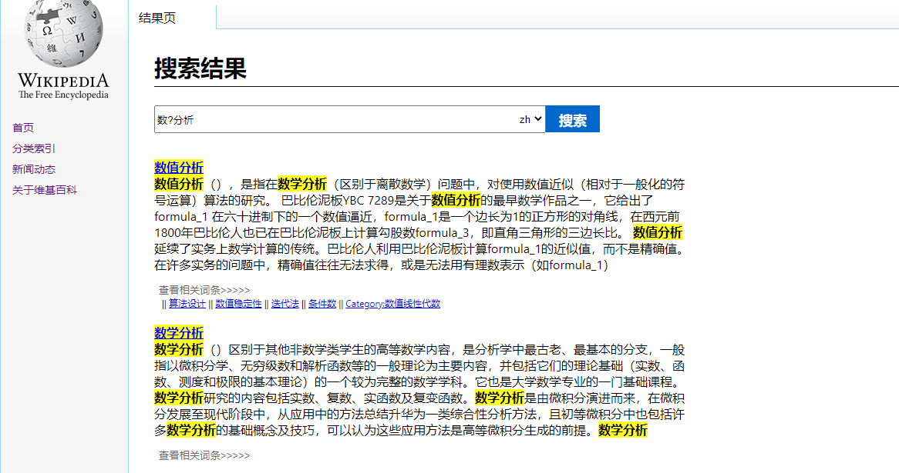
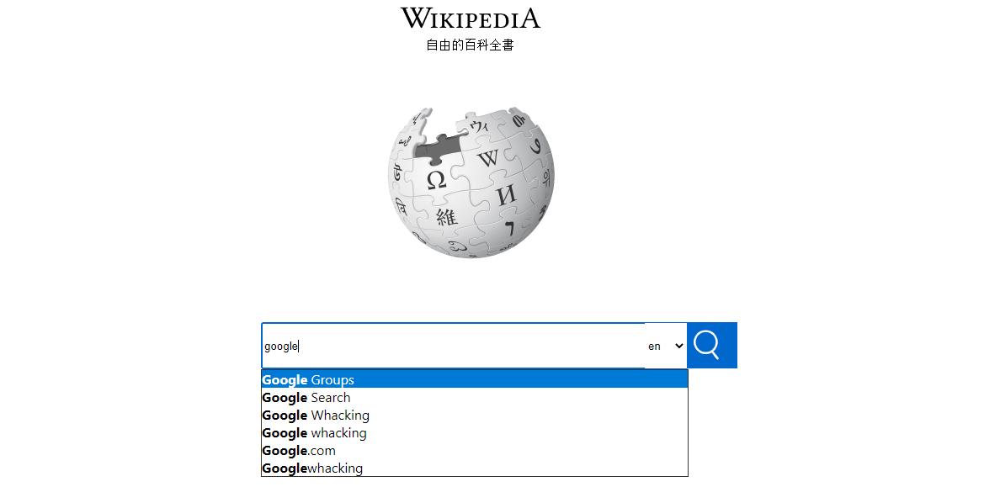
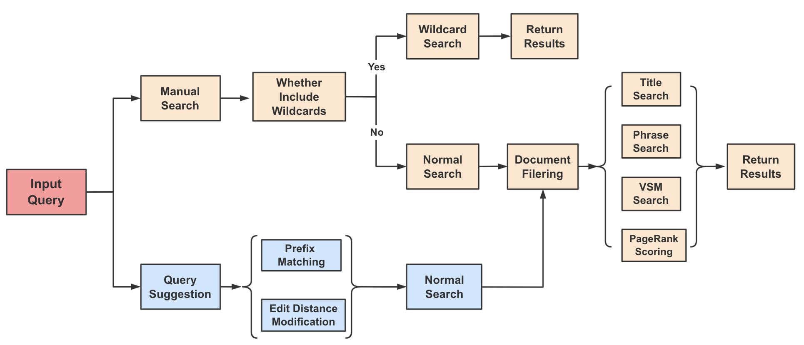

# Wiki-IR-System
This is the course project of Introduction to Information Retrieval in Spring Semester, 2020, University of Chinese Academy of Sciences, which realizes a Wikipedia information retrieval system, i.e. search engine, in English and Chinese.

## Project Participants
- [Ren Li](https://github.com/renli1024): Searching Algorithm Module
- [Jisong Yang](https://github.com/jisongyang): Data Processing Module
- [Rui Zhang](https://github.com/Alice828): Graphical Interface Module


## Introduction
This project realizes the whole process of a (scaled-down) search engine system for Wikipedia in English and Chinese, from indexing raw data, processing queries, matching relevant documents to demonstrating results, without resorting to any external index or retrival tools. 
The functions implemented include inverted-index construction, title search, phrase search, Vector Space Model (VSM) search, wildcard search, PageRank analysis, query suggestion and relevant document recommendation.
The project also conducts several optimizations for the time and memory consumption of the system. 

By test, for data scale of 350,000 documents and 130,000,000 inter-doc links, the average time of top 10 search is about 1s in common 8G memory laptop computers.









## System Optimizations
1. Before searching, filter the documents by matching query words to remove the large proportion of irrelevant docs. 
2. Store the inverted-index into a set of disk files to prevent the memory space consumption. Meanwhile maintain a map record between the index term and the corresponding file location, which can reduce the file locating time from O(n) to O(1). 
3. Transform the bottom matrix implementation to sparse format, which can greatly improve the space and time computing complexity. 
The space complexity of term-document matrix is reduced from O(mn) to O(t), where m is the number of document, n is the number of term and t is the total number of words (usually much smaller than mn); the space complexity of link importance matrix is reduced from O(m^2) to O(e), where e is the number of links (much smaller than m^2).
4. For top k search, improve the document sorting process to partition and sorting two steps. First partition docs into the largest k and others, which consumes O(m) complexity. Then only sort the top k objects, which consumes O(klogk) complexity (usually very small). This can reduce the sorting consumption from O(mlogm) to O(m) complexity. 


## Code Files
- query.py: searching function file
- utils.py: system utility file 
- config.py: configuration file
- web/: web service files
- data_preprocess/: data pre-processing files (the parsing of wiki source data utilizes [wikiextractor](https://github.com/attardi/wikiextractor) tool)

## Project Running
1. Download wiki dump files from the official [website](https://dumps.wikimedia.org/backup-index.html). Run `data_preprocess/` code to parse files and generate documents and inverted-index (specific steps in the following). 
2. Run the `query.py` file to conudct the searching, which includes: 
    - `QueryHelper`: main class
    - `QueryHelper.search()`: search function
    - `QueryHelper.complete_query()`: query suggestion function
    - `QueryHelper.recommend_sim_doc()`: relevant document recommendation function
3. Run the `web/` code to demonstrate results in the graphical interface: 
    1. Download Node.js JavaScript runtime
    2. Execute `npm start` command to start the web service
    3. Run `server.py` to start the python program
- Note that the `web/` module is not necessary. The `query.py` results can be also demonstrated by terminal.

- Specific procedures of `data_preprocess/` code:
```shell
# step 1
(1) download Wikiextractor tool and put it into xml_process directory
(2) cd  data_preprocess/xml_process/wikiextractor-master
(3) put wiki dump .bz2 file here
(4) parse the file
"python ./WikiExtractor.py --json -b 10M ./enwiki-20200420-pages-articles-multistream8.xml-p1268692p1791079.bz2"

# step 2
(1) cd  data_preprocess/xml_process
(2) set the parsed wiki file path in .py file
(3) process the file
"python xml_process.py" / 
"python xml_process_zh.py"

# step 3
(1) cd data_preprocess
(2) set the step 2 output file path in .py file
(3) post-process the file
"python data_process.py" / 
"python data_process_zh.py"
```

