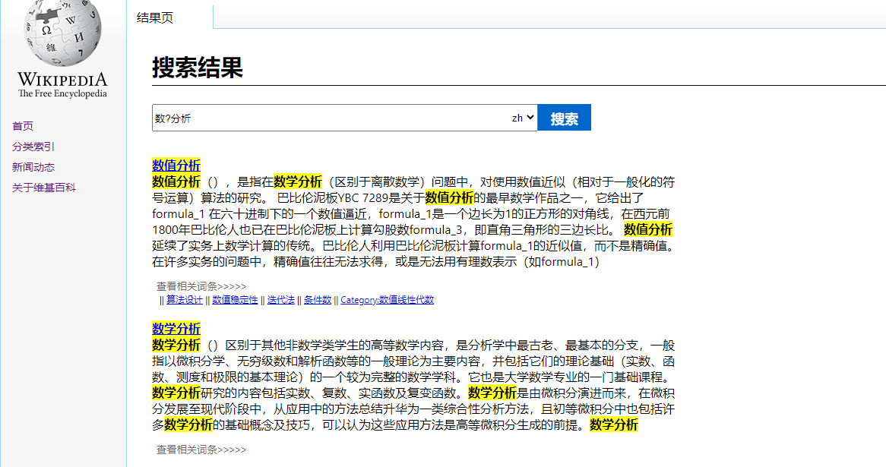
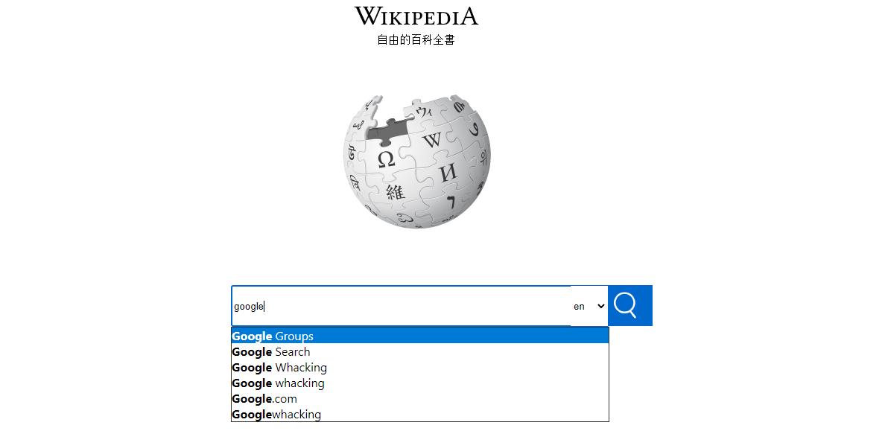
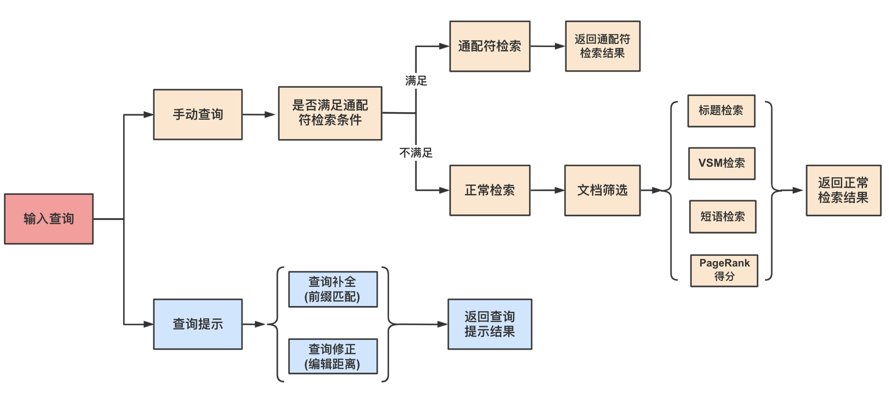

# Wiki-IR-System
本项目是中国科学院大学网络空间安全学院2020春季学期《信息检索导论》的课程大作业, 实现了针对中英文维基百科的检索系统.

## 参与人员及分工
- [Ren Li](https://github.com/renli1024): 检索模块
- [jisongyang](https://github.com/jisongyang): 数据处理模块
- [Alice828](https://github.com/Alice828): 界面展示模块

## 介绍
针对中、英文维基百科的检索系统, 数据使用官方wiki dump, 不借助任何索引构建和检索工具, 实现了VSM检索、PageRank链接分析、通配符检索、查询补全、相关文档推荐等功能, 并进行了若干检索速度和内存占用的优化. 

目前在35w文档数 (5个wiki multistream文件), 1.3亿链接数的情况下, 在普通8G内存计算机上, 平均top 10检索时长为1s左右.

## 代码结构
- query.py: 核心检索功能的实现文件
- utils.py: 系统辅助类的实现文件
- config.py: 配置文件
- web/: web服务器配置文件
- data_preprocess/: 数据预处理文件, 解析原始wiki dump文件 (解析数据借助了开源工具[wikiextractor](https://github.com/attardi/wikiextractor)).
